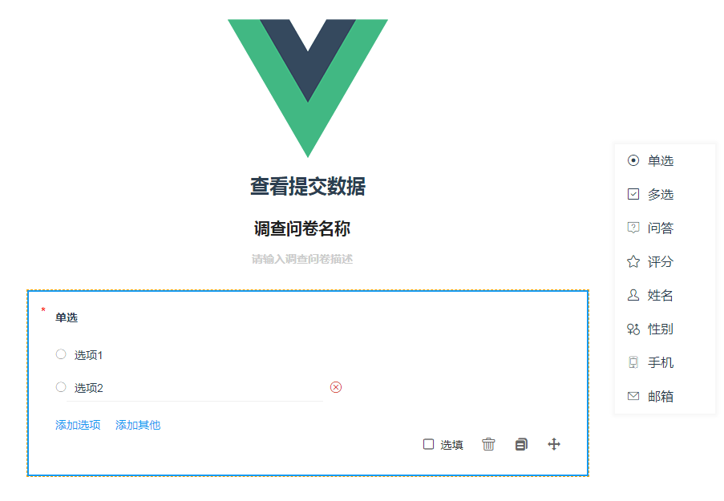
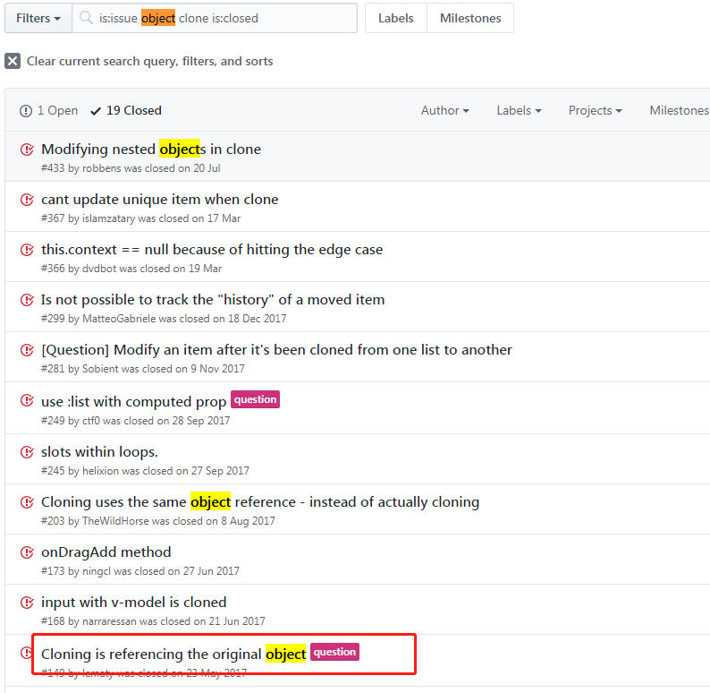

# 一个由Js对象引发的血案

## 背景

> 背景：最近公司有需求做一个以下的功能，通过右侧菜单的拖拽或者点击，在左侧创建对应题型，并可对题型进行编辑.见下图



!> 确定需求后，整体分析一下，然后如行云流水般开搞。但是爱就像蓝天白云晴空万里，忽然暴风雨，突然出现一个奇怪的问题。

以单选题为例：当我创建一个单选题后，然后在左侧编辑过单选题的选项后`（修改choice）`，而后再通过右侧创建的单选题，默认的数据结构是跟我刚编辑过的题目一样。

```javascript
//单选题数据结构如下
{
	title: '单选',
	type: 'single', //题目类型
	required: true, //此题是否必填
	isEdit: false, //默认编辑状态
	choice: [{
			title: "选项1",
			type: "normal", //标记选项类型（normal:普通选项、other其他选项）
		},
		{
			title: "选项2",
			type: "normal",
		},
	]
}
```
## 问题分析

> 由于此功能是基于vue.draggable实现的，并且我启用了clone功能，所以我开始怀疑是不是因为对象的clone问题导致，于是在该插件的issue中搜索关键字object clone，果不其然，有人跟我遇到过同样的问题，见下图。( 善用github的重要性)



## 解决问题

> 知道问题产生的原因就好说了，通过vue.draggable官方提供的clone钩子函数，在进行数据克隆的时候，对对象进行一次深克隆，便会解决此问题

```javascript
//我实现深克隆的方法
function deepClone(obj){
    let newObj = obj instanceof Array ? [] : {};
    for (let i in obj) {
    	//判断属性是否从原型中继承而来
        if (obj.hasOwnProperty(i)) {
            newObj[i] = typeof obj[i] == 'object' ? deepClone(obj[i]) : obj[i];
        }
    }
    return newObj;
}

//比较简便的方法(注意：此方法无法处理function，无法处理Reg，无法处理循环引用对象)
JSON.parse(JSON.stringify(obj));

//生产环境可以上lodash
```

## 现象分析( 多问几个为什么 )

js的数据类型分为基本数据类型和复杂数据类型。

基本数据类型：`Number、Boolean、String、Null、Symbol（ES6 新增）`

复杂数据类型：`Object，其他引用类型（Array、Date、RegExp、Function、基本包装类型（Boolean、String、Number）、Math等）`都是Object类型的实例对象

!> 因为复杂数据类型通常存储的数据量是比较大的，所以js从优化的角度出发，做出了以下行为

- 克隆：基本数据 => 复制这个变量，在内存中开辟一个全新的空间来存储

- 克隆：复杂数据 => 仅仅拷贝引用，指向内存中的同一块存储空间

**所以出现了文章开始的问题，在修改一个经过克隆的对象后，原始对象也被同步修改了，因为两者指向的是内存中同一块空间。**


