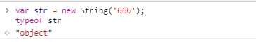
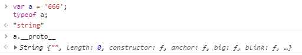
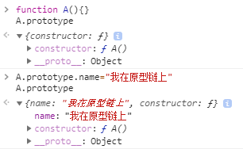
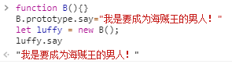
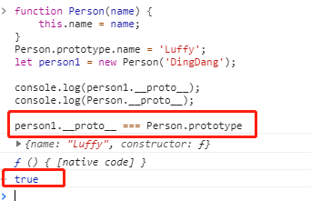
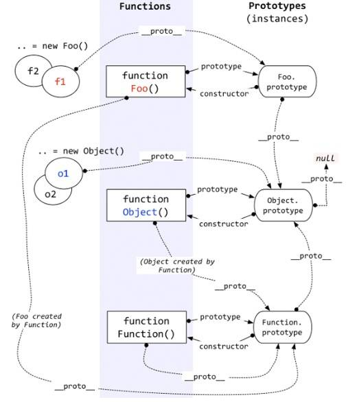

?> 个人觉得js中的原型链属于js中的一大精髓，以前有时候跟前端同事开玩笑说，一个合格的前端要熟读并背诵《Javascript高级程序设计》中第六章面向对象，这一章节基本通章都在讲原型链的各种机制及派生模式，js面向对象的实现也基本依赖于原型链，原型链的重要性不言而喻。js中的各种继承机制基本也都是基于原型链`prototype和__proto__`来实现的，之前对各种概念都有一些了解，用起来也没啥问题，但是一直没有系统的深入了解过,今天和大家一起来系统的学习下。

## 何为js原型

引用《JavaScript权威指南》的一段描述

```
Every JavaScript object has a second JavaScript object (or null ,
but this is rare) associated with it. This second object is known as a prototype, and the first object inherits properties from the prototype.

```

翻译成中文：每一个JS对象一定关联着另外一个JS对象(也许是`null`，但是它一定是唯一的)。这个另外的对象就是所谓的原型对象。每个对象从它的原型对象中继承属性和方法。

读完这句话，大家可能脱口而出一句话:"WTF!" ，这什么鬼，没事我们慢慢来。

> `js中有句老话，叫万物皆对象.`

大家可能会有疑惑，不是还有number、string等基本数据类型么。

但是基本类型的也是有类的，也属于对象的一环，只是我们正常做开发，不会用构造函数的方式去实例化这些数据罢了，举个例子见下图：



即便是我们声明的基本数据类型，无形中也关联着另外一个对象，`真是万物皆有灵，js灵特多`
再举个例子：



即便你本身不是对象，也一定跟某个对象之间有说得清，道得明的联系。 这也是为什么说js中万物皆对象，如果js是一个人的话，我觉得这便是对js一生的一个总结，也是对js编程思想的一种总结。（个人愚见，欢迎大家拍砖）

这里又引出一个概念，`__proto__`，不要蒙，后面会讲到。

## 原型的分类及理解

原型分两类：隐式原型和显示原型

> 显式原型

当你创建一个函数时，JS会为这个函数自动添加`prototype`属性，这个属性的值是一个对象，也就是原型对象(即`函数名.prototype`)。这个对象并不是空对象，它拥有`constructor`属性，属性值就是原函数。当然，你也可以自己在原型对象中添加你需要的属性(即`函数名.prototype.属性名=属性值`). 见下图：



那么原型对象的(`prototype`)有什么用？通过构造函数构造出来的实例可以直接访问其原型对象中的属性，这也是js实现继承的一种方式。
见下图：



需要注意的是：

!> **显式原型（prototype）只有函数才拥有。我们后面讲的隐式原型则是所有对象都有。**


> 隐式原型

js中任意对象都有一个内置属性[[prototype]]，在ES5之前没有标准的方法访问这个内置属性，但是大多数浏览器都支持通过`__proto__`来访问。我们所谓的隐式原型就是`__proto__`了。

隐式原型指向创建这个对象的函数的prototype（Object.create函数构造出来的实例有点例外，后面会说明。其实也不是例外，只是它经过了一定的封装）。看下面的例子

```javascript
function Person(name) {
    this.name = name;
}
Person.prototype.name = 'Luffy';
let person1 = new Person('DingDang');

console.log(person1.__proto__); //person { name: 'Luffy' }
console.log(Person.__proto__);  //[Function]

```

`person1`的`__proto__`很容易理解：它是由`Person`方法构造的实例，它的`__proto__`自然就是`Person.prototype`，见下图红框处：

`person1.__proto__ === Person.prototype 为 true`，js中判断引用类型的数据是否全等，是判断是否指向内存中同一块存储区存放的对象，所以两者引用的同一个对象。




`Person`的`__proto__`呢？其实每一个方法的构造方法都是`Function`方法，也就是所有方法的`__proto__`都是`Function.prototype`。如果现在还不理解也没关系，后面会有一副图帮你理解。


**一张图带你形象理解`__proto__`和`prototype`**



我们来理解一下这幅图：

1.构造函数`Foo()`

- 构造函数`Foo`的原型属性`prototype`指向了它的原型对象`Foo.prototype`。原型对象`Foo.prototype`中有默认属性`constructor`指向了原函数`Foo`。

- 构造函数`Foo`创建的实例`f1,f2`的`__proto__`指向了其构造函数的原型对象`Foo.prototype`，所以`Foo`的所有实例都可以共享其原型对象的属性。

- 构造函数`Foo`其实是`Function`函数创建的实例对象，所以它的`__proto__`就是`Function`函数的原型对象`Function.prototype`。

- 构造函数`Foo的原型对象`其实是`Object`函数创建的实例对象，所以它的`__proto__`就是`Object`函数的原型对象`Object.prototype`。


2.`Funtion`函数

- 你所写的所有函数，其实都是`Function`函数构造的实例对象。所以所有函数的`__proto__`都指向`Fucntion.prototype`。

- `Function`函数对象是由它本身创建（姑且可以这么理解），所以`unction.__proto__`等于`Function_prototype`

- `Function`函数的原型对象其实是`Object`函数创建的实例对象，所以它的`__proto__`就是`Object`函数的原型对象`Object.prototype`。


3.`Object`函数

- `Object`函数其实是`Function`函数创建的实例对象，所以它的`__proto__`就是`Function`函数的原型对象`Function.prototype`。

- 需要注意的是：`Object.prototype`的`__proto__`是指向`null`的！！！


**上图如果你已经完全理解，那么，恭喜你离前端大神又近了一步~~ :D**